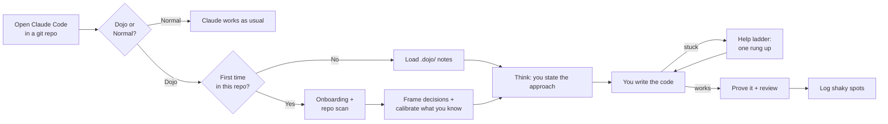

<div align="center">

# 🥋 Code Dojo

**Learn to build things on a real project, with Claude as your coach instead of your ghostwriter.**


[How it works](#-how-it-works) · [Install](#-install) · [Commands](#-commands) · [Skills](#-skills-in-detail) · [Hooks](#-hooks) · [Limitations](#-honest-limitations)

</div>

---

AI can write a whole project while you still can't explain how it works. Code Dojo flips the roles:

> **You write the code.** Claude helps you decide, explains only what you don't know yet, gives graded hints, writes the tests and reviews what you wrote.

It runs on your own repos and your own ideas. No separate course, no toy exercises. It covers the whole project, not just code: picking tools, setting up Git and environments, clicking through a cloud console, structuring data.

## ✨ Highlights

| | |
|---|---|
| 🪜 **Help ladder** | Six rungs from a question to the full solution. One rung per request. |
| 🧭 **Decision briefs** | Databricks or Data Factory? You get the options, the one difference that matters and a pick, in 4 lines. You choose. |
| 🎯 **Calibrated** | One question about what you already know. Known topics are never explained; unknown ones get a 6-line lesson when first needed. |
| 🧠 **Think first** | You state the approach before any code is written. |
| 🔍 **Repo scan** | Reads an existing project once, learns *your* style, asks improvement questions. |
| 🔮 **Prove it** | After it works you predict, change or break your code. No recitals, no copy-paste understanding. |
| 🧾 **Memory** | Shaky spots are logged in `.dojo/` and come back in later sessions. |
| 🪶 **Light on tokens** | One question per turn, short lessons, no re-explaining. About 150 tokens once per session and about 70 per prompt. Zero in Normal mode. |

---

## 🧭 How it works



### 1. It asks at the start of every session

Open Claude Code inside a git repo and Claude asks once how to run the session:

| Choice | What happens |
|---|---|
| 🥋 **Dojo** | Learning mode for this session only. |
| 💬 **Normal** | Code Dojo stays out of the way. Claude behaves as usual. |
| 🔕 **Normal, and stop asking here** | Same as Normal, and this project is never asked again. |

The choice is per session, so one repo can be a learning project on Monday and a "just get it done" project on Tuesday. Outside git repos nothing is asked.

### 2. The first time, it gets to know you and your code

In Dojo mode, the first run asks only what your message and repo don't already answer: what you want to **build** and your rough **level** (zero, basics, intermediate). Then it frames the project:

| Step | What happens |
|---|---|
| **Frame** | Claude lists the decisions the goal needs (platform, hosting and cost, Git, notebook or script, data layout). Each real choice gets a brief of at most 4 lines: options, the one key difference, a recommendation. You pick. A clear default is stated, not asked. |
| **Calibrate** | One multiple-choice question: which of the needed concepts you already know. Saved as `Known` and `Unknown`. |
| **Help level** | How much help you want: `navigate` (questions and concept hints), `hints` (adds goal lists and examples) or `hands-on` (adds skeletons). Changeable any time. |

If the folder already contains code, Code Dojo runs a quick **read-only scan** (about 15 files, no edits):

| File | Contents |
|---|---|
| `project-map.md` | What each module does and how data flows. |
| `style.md` | How *you* write: naming, error handling, structure, tests. |

Then it tells you three things it noticed and up to three **questions** about possible improvements, such as:

> `db.py:41` catches every exception. What happens to a typo there?

You pick one, and that becomes your first task.

### 3. Then you build, and Claude holds back

**Who writes what**

| ✅ Claude may write | ❌ Claude won't write |
|---|---|
| Tests for behavior you described | Your solution to your current core task |
| Skeletons with `# TODO` | |
| Foundation boilerplate you already know (labelled as such) | |
| Examples on an unrelated problem | |
| Briefs, short lessons, reviews | |

**Foundation vs core.** Imports, `main`, config loading and patterns you already wrote once are foundation. Claude may hand them over so you don't waste time. The part the project exists for (the transformation, the query, the algorithm) is core and always yours.

**Unknown topics get a micro-lesson**, never an article: what it is, why it matters here, one thing to do, how to prove it is done. Max 6 lines, then the keyboard is yours.

**External tools.** Claude walks you through consoles, CLIs and setup one step at a time ("open X, find Y, tell me what you see"), defines new terms in one line and checks your result from pasted output or a screenshot. It never clicks for you.

**The help ladder.** Stuck? Claude gives one rung at a time, never the answer first:

| Rung | Claude gives you | Example |
|:---:|---|---|
| 1 | A question | "What goes in, what comes out?" |
| 2 | A concept hint | "You need to loop over the words." |
| 3 | A goal list | What happens, in order, never how |
| 4 | An analogous example | Same idea, *different* problem |
| 5 | A skeleton | Signature plus `# TODO` lines for you |
| 6 | The full solution | Only after you tried rung 5, then you explain it back line by line |

> [!NOTE]
> "Just write it" is not refused coldly. It simply moves you one rung up. Your `Help` level sets how far Claude goes on its own without being asked.

**Two light checkpoints**

- **Think (before code).** You state the approach in a few sentences, or write a plan as comments in an empty file. Claude reacts with at most two questions.
- **Prove it (after it works).** You predict ("what if the input is empty?"), change ("now it must also do X") or break it on purpose. A wrong prediction is the next small exercise.

**Review.** First "what would you change?", then at most three points ordered bug, design, style, checked against your own `style.md`.

### 4. It remembers

Notes live in `.dojo/` inside your project: your level, project map, style, and a progress log that records the highest rung you needed and what was shaky.

| File | Purpose |
|---|---|
| `profile.md` | Level, language, goal, `Known`, `Unknown`, `Help`, `Boilerplate`, `Ask: always\|never` |
| `project-map.md` | Modules and data flow |
| `style.md` | Your observed habits |
| `progress.md` | Log of tasks, rungs used, shaky topics |

> [!TIP]
> Add `.dojo/` to your `.gitignore` if you don't want the notes committed.

---

## 📦 Install

In Claude Code:

```
/plugin marketplace add pprusin/code-dojo
/plugin install code-dojo@code-dojo
```

Or from a terminal:

```bash
claude plugin marketplace add pprusin/code-dojo
claude plugin install code-dojo@code-dojo
```

Restart Claude Code afterwards. Requires **Python 3** (for the hook script).

## ⌨️ Commands

| Command | What it does |
|---|---|
| `/code-dojo:learn <what you're building>` | Starts or resumes Dojo for this session. First run: onboarding plus repo scan. Pass `rescan` to refresh `style.md` and `project-map.md`. |
| `/code-dojo:stuck` | Asks what you tried, then gives exactly **one** rung higher on the ladder. Logs the gap. |
| `/code-dojo:checkpoint` | Prove-it check and review of what you just wrote. Logs what is shaky and what to revisit. |

Say **"pause dojo"** at any time to switch it off for the rest of the session.

## 🧩 Skills in detail

<details>
<summary><b><code>learn</code></b>: entry point and home of the coaching rules</summary>

<br>

| File | Role |
|---|---|
| `SKILL.md` | Turns Dojo on for the session, finds `.dojo/`, resumes or runs onboarding. |
| `behavior.md` | The rulebook: who writes what, saving your time, the help ladder, Think and Prove it, blockers, review style. |
| `guide.md` | From goal to project: decision briefs, calibration, micro-lessons, walking through external tools, architecture, foundation vs core. |
| `scan.md` | First-run repo scan procedure. |
| `state-templates.md` | Formats of the `.dojo/` files. |
| `lang/python.md` | Python progression (functions through pipelines), common beginner mistakes, coaching moves. |

</details>

<details>
<summary><b><code>stuck</code></b>: next rung when you are blocked</summary>

<br>

Finds the highest rung already given for the current problem and gives only the next one. Ends by handing the keyboard back with one concrete action.

</details>

<details>
<summary><b><code>checkpoint</code></b>: prove-it and review when something works</summary>

<br>

You predict and change, Claude reviews, and the result goes into `progress.md`, so the next session starts from your real weak spots.

</details>

## 🪝 Hooks

One small Python script (`hooks/dojo_hook.py`) keeps the whole thing cheap:

| Event | Behavior | Cost |
|---|---|---|
| Session start or clear (in a git repo) | Tells Claude to ask Dojo, Normal, or stop asking. | about 150 tokens, once |
| Resume, compact, fork | If Dojo was on in the session, tells Claude to re-read the rules. | small, once |
| Every prompt | If Dojo is on, injects a short reminder so the rules don't fade in long sessions. | about 70 tokens |

Per-session state is a marker file in `~/.claude/code-dojo/sessions/`. In Normal mode the hook adds nothing.

## ⚠️ Honest limitations

- The rules are instructions to Claude, not a lock. A very insistent prompt can still make it slip. The per-prompt reminder and the ladder design reduce this but don't eliminate it.
- Only **Python** has a language guide so far. Other languages work with the generic rules. Add `skills/learn/lang/<language>.md` for more.

## 🗂️ Layout

```
.claude-plugin/     plugin.json, marketplace.json
hooks/              hooks.json, dojo_hook.py
skills/
  learn/            SKILL.md, behavior.md, guide.md, scan.md, state-templates.md, lang/
  stuck/            SKILL.md
  checkpoint/       SKILL.md
tests/              test_hook.py
```

## 🛠️ Development

```bash
python3 -m unittest discover tests
claude plugin validate .
```

## 📄 License

[MIT](LICENSE)
