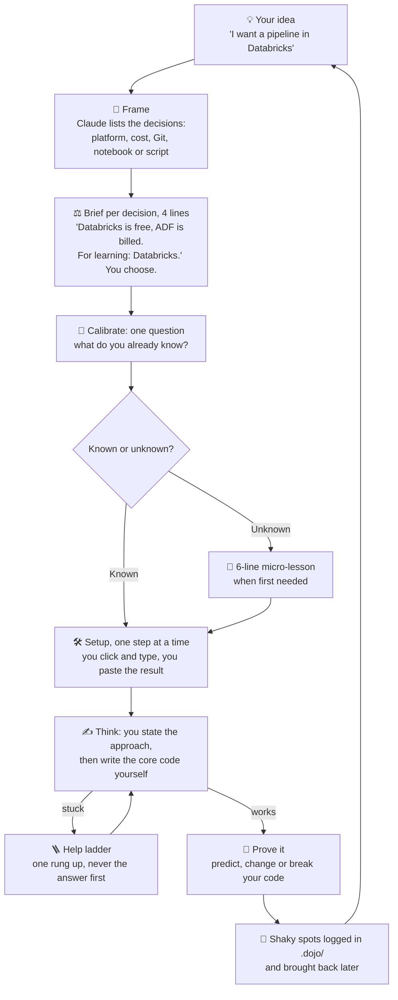

<div align="center">

# 🥋 Code Dojo

**Learn to build things on a real project, with Claude as your coach instead of your ghostwriter.**


</div>

AI can write a whole project while you still can't explain how it works. Code Dojo flips the roles:

> **You do the work.** Claude helps you decide, explains only what you don't know yet, gives graded hints, and reviews what you wrote.

It runs on your own repos and ideas, and covers the whole project: choosing tools, Git and environments, clicking through a cloud console, structuring data, then the code.

## 🧭 How it works

You start with an idea, not a lesson. Example: *"I want a Databricks pipeline in Python."*



## 🔑 Key ideas

| | |
|---|---|
| ⚖️ **Decision briefs** | Options, the one difference that matters, a recommendation. You choose. A clear default is stated, not asked. |
| 🎯 **Calibrated** | Known topics are never explained. Unknown ones get a short lesson at the moment you need them, never an article. |
| 🧩 **Foundation vs core** | Boilerplate you already know may be handed over, labelled. The part the project exists for is always yours. |
| 🪜 **Help ladder** | Question, concept hint, goal list (what, never how), analogous example, skeleton, full solution. One rung per request. `Help` level (`navigate`, `hints`, `hands-on`) sets how far Claude goes unasked. |
| 🔮 **Prove it** | You predict ("what if the input is empty?"), change ("now it must also do X") or break the code. No recitals. |
| 🪶 **Light on tokens** | One question per turn, lessons capped at 6 lines. About 150 tokens once per session, about 70 per prompt, zero in Normal mode. |

At session start Claude asks once in a git repo: **Dojo**, **Normal** (plugin stays out of the way), or **Normal and stop asking**. Say "pause dojo" any time to switch it off.

## 📦 Install

```
/plugin marketplace add pprusin/code-dojo
/plugin install code-dojo@code-dojo
```

Restart Claude Code. Requires Python 3 (hook script).

| Command | What it does |
|---|---|
| `/code-dojo:learn <what you're building>` | Start or resume. First run: framing, calibration, repo scan. `rescan` refreshes the notes. |
| `/code-dojo:stuck` | Exactly one rung higher on the ladder. |
| `/code-dojo:checkpoint` | Prove-it check and review of what you just wrote. |

## 🗂️ Layout

```
skills/learn/   SKILL.md, behavior.md (rules), guide.md (decisions, lessons, tools), scan.md, state-templates.md, lang/
skills/stuck/, skills/checkpoint/
hooks/          dojo_hook.py (session question, per-prompt reminder)
```

Notes live in `.dojo/` in your project (`profile.md` with `Known`, `Unknown`, `Help`; `project-map.md`; `style.md`; `progress.md`). Add it to `.gitignore` if you don't want it committed.

## ⚠️ Limitations

- Rules are instructions to Claude, not a lock. An insistent prompt can make it slip.
- Only Python has a language guide (`skills/learn/lang/`). Other languages use the generic rules.

Development: `python3 -m unittest discover tests` · `claude plugin validate .` · [MIT](LICENSE)
